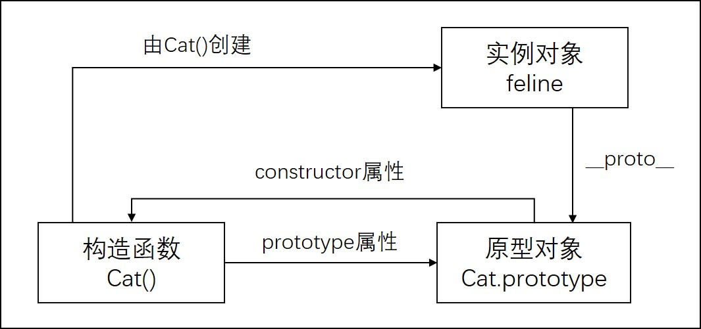
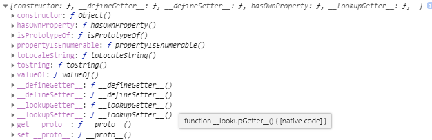

# JavaScript 原型和原型链

## JavaScript 中的对象和构造函数

由于历史原因，JavaScript 虽然有对象，但是没有类似于 c++和 Java 中的"类"的概念的(在 ES2015/ES6 中引入了 class 关键字，但那其实只是个语法糖)。
与 java 等不同，虽然声明一个对象也是通过使用 new 关键字，但是后面跟的是一个"特殊的"函数 —— 构造函数，通常用首字母大写来与一般的函数区分。

> Java 中声明对象实例:
>
> ```Java
> ClassName obj = new ClassName()
> ```
>
> JavaScript 中声明对象实例:
>
> ```JavaScript
> const obj = new FunctionName()
> ```

但是仅仅用函数来创建有一定的问题，就是会生成很多重复的代码。

> 例：
>
> ```JavaScript
> function Cat(name) {
>  this.name = name
>  this.sound = "miao~"
>  this.greeting = function() {
>    console.log("Hi,i'm "+this.name)
>  }
> }
> // 通过Cat构造函数声明两个实例
> const feline = new Cat("feline")
> const Schrödinger = new Cat("Schrödinger")
>
> // 虽然 feline 和 Schrödinger 中的 greeting 方法不论是代码还是作用都是一样>的，但是仍然是两个不同的引用
> console.log(feline.greeting === Schrödinger.greeting)  // false
> ```

有上面的例子可以看出，单纯的使用构造函数创建实例有个缺陷，每创建一个实例，就要重新创建其中的方法，生成了很多重复的代码。实际上我们只需要创建一次，然后在每个实例中添加引用就可以了。

比如这样：

```JavaScript
function greeting() {
  console.log(this.name)
}
const sound = "miao~"

function Cat(name) {
  this.name = name
  this.sound = sound
  this.greeting = greeting
}

const feline = new Cat("feline")
const Schrödinger = new Cat("Schrödinger")

console.log(feline.greeting === Schrödinger.greeting)  // true
```

上述问题，JavaScript 提供了一种更好的解决方案，就是给构造函数添加了一个 prototype 属性。

## prototype (原型)

每个函数都有 prototype 属性，他指向一个对象，包含了所有需要共享的方法和属性，通常被称为原型对象。可以通过 fun.prototype 来获得。

```JavaScript
function Cat() {

}

console.log(Cat.prototype)
// 控制台打印出的下面这个对象就是Cat的prototype，原型对象
// {
//   constructor:Cat()
//   __proto__:Object
//   上面两个属性之后会提到，现在暂时不用管
// }
```

因为通过同一个构造函数创建的所有实例都可以访问这个构造函数的原型对象上的方法和属性。所以，我们可以将每个实例独有或私有的属性和方法都放在构造函数中，而共享的则放在构造函数的原型对象中。
通过使用 prototype，Cat 构造函数可以改写成一下形式

```JavaScript
function Cat(name) {
  this.name = name
}

Cat.prototype.sound = "miao~"
Cat.prototype.greeting = function() {
  console.log(this.name)
}

const feline = new Cat("feline")
const Schrödinger = new Cat("Schrödinger")

console.log(feline.greeting === Schrödinger.greeting)  // true
```

prototype 对象中的 greeting 方法和 sound 属性是 feline 和 Schrödinger 共享的。当我们修改 prototype 中的值时，两个实例中的值也都会随之改变。所以，这个 prototype 也就可以看作是实例对象的原型。

```JavaScript
console.log(feline.sound) // miao~
console.log(Schrödinger.sound) // miao~
// 当修改Cat.prototype上的值时，实例中的值也会随之改变
Cat.prototype.sound = "Yo!Check it out!"
console.log(feline.sound) // Yo!Check it out!
console.log(Schrödinger.sound) // Yo!Check it out!
```

feline 和 prototype 和这种关系，就好像"继承"一样，feline"继承"自 prototype，所以在 feline 上可以访问到 prototype 上的属性和方法。

## 原型链

要理解原型链，首先要理解几个关键的概念。

- `__proto__`：每个对象都有一个隐藏的属性`[[Prototype]]`(双中括号不能少)，表示其对象的原型，也就是其构造函数的原型对象。可以通过 Object.getPrototypeOf()或`__proto__`来获得。
  > <font size="2">`__proto__`属性是一个访问器属性，(一个 getter 函数和一个 setter 函数),暴露了他访问的对象的内部的`[[prototype]]`。MDN 中这样描述：使用`__proto__`是有争议的，也不鼓励使用它。因为它从来没有被包括在 EcmaScript 语言规范中，但是现代浏览器都实现了它。`__proto__`属性已在 ECMAScript 6 语言规范中标准化，用于确保 Web 浏览器的兼容性，因此它未来将被支持。它已被不推荐使用, 现在更推荐使用 Object.getPrototypeOf/Reflect.getPrototypeOf 和 Object.setPrototypeOf/Reflect.setPrototypeOf（尽管如此，设置对象的`[[Prototype]]`是一个缓慢的操作，如果性能是一个问题，应该避免）。</font>
- prototype：在 JavaScript 中，函数可以有属性。每个函数都有一个特殊的属性叫 prototype(原型)，指向函数的原型对象。要注意，二者虽指向同一个对象，但是是两个不同的概念。`__proto__`是每个对象都有的属性，而 prototype 是函数的属性。
  > 用上面的 Cat 构造函数举例:
  >
  > ```JavaScript
  > const feline = new Cat("feline")
  > console.log(feline)
  > console.log(feline.__proto__ === Cat.prototype) // true
  > ```
  >
  > 我们可以得到这样一个关系：
  > 通过构造函数创建的对象，其`__proto__`指向构造函数的 prototype
- constructor：在控制台中打印构造函数的 prototype，可以发现 prototype 中还包含了一个属性 constructor，该属性指向了用于构造此实例对象的构造函数。

  > 获取 Cat 原型中的 constructor，可以看到 Cat 的原型中包含的 constructor 属性指向一个 Cat(),也就是 Cat 构造函数本身，我们也可以在 JavaScript 中验证这一点。
  >
  > ```JavaScript
  > function Cat() {
  >
  > }
  > console.log(Cat.prototype)
  > // {
  > //   constructor:Cat,
  > //   __proto__:Object
  > // }
  > console.log(Cat.prototype.constructor === Cat)  // true
  > ```
  >
  > 通过上述代码可以得到这样一个关系：
  > 构造函数的原型对象中的 constructor 指向构造函数本身

**上述关系可以用下图表示**


现在我们知道了实例对象的`__proto__`指向其构造函数的 prototype 原型对象，那既然每个对象都有`__proto__`,那么原型对象的`__proto__`指向哪里呢？实践出真知，在控制台打印一下。

```JavaScript
function Cat() {

}
console.log(Cat.prototype.__proto__)
```

打印出来的对象

看上去一堆方法属性，没名没姓的，无法判断他是什么，来自哪里。但仔细观察可发现这个对象是包含 constructor 属性的。根据之前的关系，constructor 属性指向其构造函数，可知，这个对象就是 Object()构造函数的原型对象。

```JavaScript
console.log(Cat.prototype.__proto__.constructor) // Object()
console.log(Cat.prototype.__proto__ === Object.prototype) // true
```

> 还可以从另一个角度理解，所有对象都是 Object()构造函数的示例，所以显而易见，所有对象的`__proto__`都指向 Object.prototype，也就是 Object()的原型对象。

```JavaScript
const obj1 = {
  a:1
}
console.log(obj1.__proto__ === Object.prototype) // true
```

既然所有的对象的`__proto__`都指向 Object.prototype,那 Object.prototype 指向谁呢。照旧，在控制台打印。

```JavaScript
console.log(Object.prototype.__proto__) // null
```

Object 原型对象的`__proto__`为 null，即没有原型。
至此，我们可以给上图再添加一层

图中，实例对象 feline 的`__proto__`指向 Cat.prototype，Cat.prototype 的`__proto__`指向 Object.prototype,Object.prototype 的`__proto__`指向 null。由`__proto__`作为联系创建的链状结构就是原型链。

## 原型链和继承

在 JavaScript 中，当试图访问一个对象的属性时，它不仅仅在该对象上搜寻，还会搜寻该对象的原型，以及该对象的原型的原型，依次层层向上搜索，直到找到一个名字匹配的属性或到达原型链的末尾。这种形式就是 JavaScript 中的"继承"。

> ```JavaScript
> const a1 = {
>   name: "a1"
> }
>
> const a2 = {
>   name: "a2"
> }
>
> // 通过Object.create(obj)创建的对象，其原型会指向obj
> // 这里b的原型指向a，即可认为b"继承"自a
> const b = Object.create(a1)
> // 此时的原型链为
> // b --> a1 --> Object.prototype --> null
> console.log(b.name)  // a1
> console.log(b.__proto__ === a1);  // true
>
>
> const c = Object.create(b)
> // 此时的原型链为
> // c --> b --> a1 --> Object.prototype --> null
> // 打印c
> console.log(c); // {}
> // c继承自b，访问c.name时，由于c中没有name属性，所以会根据原型链进行查找
> // 直到获取a1.name的值
> console.log(c.name);  // a1
> console.log(c.__proto__ === b);  // true
> console.log(c.__proto__.__proto__ === a1);  // true
>
> // 手动更改c的原型为a2
> // 更改后再次调用c.name的值，同理，会获取到a2.name的值
> c.__proto__ == a2
> // 打印c
> console.log(c);  // {}
> console.log(c.name);  // a2
> console.log(c.__proto__ === a2);  // true
> // 此时的原型链为
> // c --> a2 --> Object.prototype --> null
>
> // 如果在c中更改name的值，就相当于Java中的子类重写父类
> // 再次调用c.name，此时c中已有name属性，所以返回c.name
> c.name = "c"
> // 打印c
> console.log(c); // {name:"c"}
> console.log(c.name); // c
> console.log(c.__proto__ === a2); // true 原型不变
> console.log(a2.name); // a2
> ```

JavaScript 中的继承就是这种基于原型链的继承，如声明一个数组 A，我们可以使用 A.slice,A.push 等方法，数组 A 中是没有这些方法的，这些方法都是继承自 JavaScript 中的 Array 的原型对象。

## 基于原型链继承中的一个特殊情况 ~~应该算特殊情况吧~~

回到这张图

图的右侧演示了 JavaScript 中的对象的原型链。可是在 JavaScript 中，函数也是一个对象，那么，图中左半部分的构造函数 Cat 和 Object 就也有`__proto__`，他们的`__proto__`又是指向哪里呢？
我们还是来到控制台...

```JavaScript
// 构造函数
function Cat(name) {
  this.name = name
}
// 一般函数
function fun(num) {
  return num +1
}
console.log(Cat.__proto__.constructor);   // Function
console.log(fun.__proto__.constructor);  // Function
console.log(Object.__proto__.constructor);  // Function
console.log(Object.__proto__ === Cat.__proto__); // true
console.log(Object.__proto__ === fun.__proto__); // true
```

通过上面的代码可以得知，Cat,fun 和 Object 的原型都指向 Function，而且是同一个 Function，可知，函数对象和普通的对象还有一些区别，就是函数对象的原型为 Function.prototype,而不是 Object.prototype。
由此引出了本节的主角，Function，他就是原型链中的一个特殊情况。~~是可以算作特殊情况的吧！~~

```JavaScript
console.log(Cat.__proto__ === Function.prototype)  // true
console.log(Object.__proto__ === Function.prototype)  // true
console.log(Function.__proto__ === Function.prototype)  // true
```

上面的代码，前两句之前已经验证过了，问题就在于第三句，Function 的`__proto__`也是 Function.prototype？我继承我自己？那不是无限递归了吗？感觉这里可以这样理解：
构造函数的 prototype 相当于一个仓库，通过构造函数创建的对象都可以使用这个仓库中的东西。一般情况下，直接在构造函数上访问是访问不到的。
用构造函数 Array 举例:

```JavaScript
const a = new Array(1, 2, 3)
console.log(a.push)  // push() [native code]
console.log(Array.push);  // undefined
console.log(Array.prototype.push);  // push() [native code]
console.log(a.push === Array.prototype.push);  // true
```

同样，比如函数中常用的 bind,call 等方法，都是放在 Function.prototype 上，这样，我们在声明的函数中都可以调用这样的方法。如果按照上面 Array 的思路来看，Function 是不能调用 Function.prototype 上诸如 bind 之类的方法的，可是 Function 也是函数，按理来说是可以调用的，这样就产生了矛盾。
所以为了解决矛盾，也是为了让 Function 也符合函数的定义，所以讲 Function 的`__proto__`设置为 Function.prototype,这样 Function 就可以像别的函数一样使用 Function.prototype 上的方法了。
结合之前的`Object.__proto__ === Function.prototype`，我们可以得到这样两条原型链:
Object --> Function.prototype --> Object.prototype --> null
Function --> Function.prototype --> Object.prototype --> null
这两条原型链也引出了一个 Object 和 Function 之间有趣的关系：

```JavaScript
console.log(Function instanceof Object);  // true
console.log(Object instanceof Function);  // true
```

二者输出均为 true，即二者相互继承。
