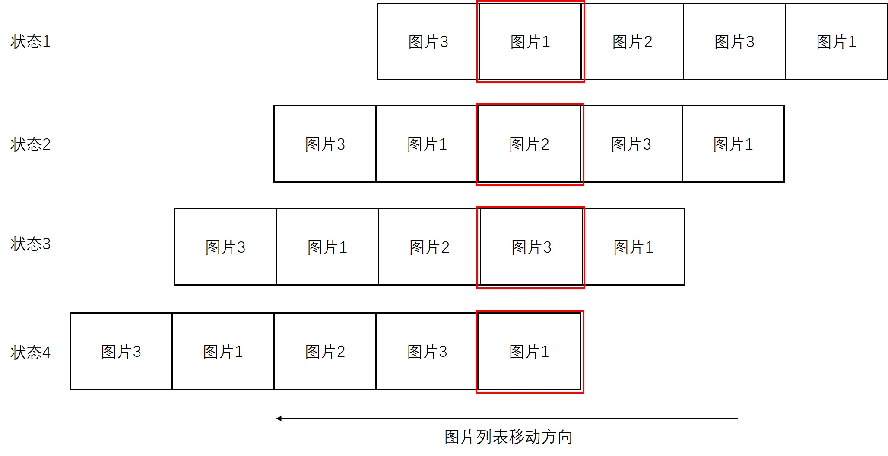

# 轮播图原理及实现

轮播图插件在网页和 app 中都很常用， 尤其是商城或作品展示类。其实网上有很多基于各种框架的轮播图插件，都是开源的，可以拿来即用。但是了解其原理和实现也是很有必要的，本文也是记录一下自己的学习和实现过程。

## 效果图

### 普通轮播图（商城和 app 中比较常用）

### 卡片式

### 堆叠式

## 轮播图原理

那普通轮播图举例，轮播图在结构上可以分成三个部分。

> 容器 —— 轮播图的主视窗，决定整个轮播图的大小。
> 图片列表 —— 轮播图图片容器。
> 按钮 —— 控制显示某张图片的相关逻辑
> 图片显示逻辑 —— 我们通过点击按钮控制容器显示图片列表中的图片，或者图片容器每隔一段时间显示图片列表中的下一张图片，当显示到图片列表最后一张图片时，从第一张图片开始重新开始循环，同理第一张图片的上一张为列表的最后一张图片。

> 原理(图示)  
>  
> 如图，红框为轮播图容器，用于显示当前图片列表的图片。当要切换到下一张或上一张时，我们只需要控制图片列表移动响应距离即可。
> 图中轮播图实际要显示三张图片，但是我们要在列表头部和尾部各添加上一张图片显示逻辑上的"下一张"和"上一张"图片。当要显示图片 3 的下一张时，我们先显示图片列表尾部的图片 1，然后我们将整个图片列表前移，使它回归到状态 1，这样就实现了图片循环播放。反向循环也是同理。

## HTML 布局

```html
<!-- 容器 -->
<div class="carousel-container">
  <!-- 图片列表 -->
  <ul class="carousel-img-list">
    <li class="list-item">
      <a></a>
    </li>
    <li class="list-item">
      <a></a>
    </li>
    <li class="list-item">
      <a></a>
    </li>
    <li class="list-item">
      <a></a>
    </li>
    <li class="list-item">
      <a></a>
    </li>
  </ul>
  <!-- 按钮 -->
  <a class="carousel-prev" href="#"></a>
  <a class="carousel-next" href="#"></a>
  <ul class="carousel-dot-list">
    <li class="list-item active"><a href="#"></a></li>
    <li class="list-item"><a href="#"></a></li>
    <li class="list-item"><a href="#"></a></li>
  </ul>
</div>
```
## 相关逻辑javascript实现
> 图片下一张，上一张切换
> > 通过更改图片列表的float值来控制在容器中显示哪一张图片
>
> 图片圆点按钮
> > 显示：通过获取当前正在显示的图片的index，给圆点按钮列表中对应index的按钮添加class active修改样式
> > 点击：获取点击的按钮的index，调整图片列表的float值(index*imageWidth)来显示对应图片
> 