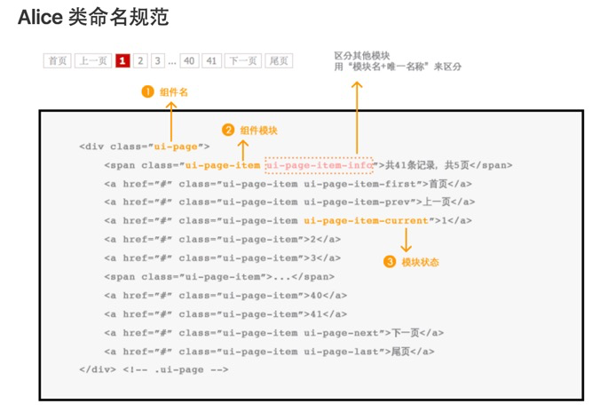

# CSS 命名规范 - 常见命名规范

每次写 css 样式，类名都命名的比较随意，有时候复用从自己别的地方的 css 样式，光改名字就要改一阵子。不统一规范的类名不利于样式复用，看起来很杂乱，也不利于主题切换等统一修改样式的情形。所以想试着了解一下常用的 css 命名规范并构建一套自己的 css 命名规范。

## 几种常见的命名规范

### [BEM(block element modifier)](http://getbem.com/)

> #### BEM 官方介绍
>
> BEM — Block Element Modifier is a methodology that helps you to create reusable components and code sharing in front-end development
>
> > Block(块):一个快代表一个独立的实体，块可以包含其他的块  
> > Element(元素):元素是块的一部分，没有单独的意义，他的语义与所处的块相关。  
> > Modifier(修饰词):块或者元素的标记。用于更改表现形式，行为或状态。
>
> #### BEM 命名规范
>
> 一个标准的 BEM 命名规范格式如下
>
> > block-name  
> > block-name**element-name  
> > block--mod-name  
> > block**element-name--mod-name
>
> > 例：  
> > HTML
> >
> > ```html
> > <form class="form form--theme-xmas form--simple">
> >   <input class="form__input" type="text" />
> >   <input class="form__submit form__submit--disabled" type="submit" />
> > </form>
> > ```
> >
> > ```css
> > .form { }
> > .form--theme-xmas { }
> > .form--simple { }
> > .form__input { }
> > .form__submit { }
> > .form__submit--disabled { }
> > ```
>  在[BEM官网命名部分](http://getbem.com/naming/)介绍的要更详细，就不在多做说明了。~~反正基本都是复制的，重点是要理解他的思想~~

### [Aliceui](https://github.com/aliceui/aliceui.github.io/)

> #### Alice 官方介绍
>
> Alice 是支付宝的样式解决方案，是一套精选的基于 spm 生态圈的样式模块集合，是 Arale 的子集，也是一套模块化的样式命名和组织规范，是写 CSS 的更好方式。
>
> 她包括了一套通用样式模块库，一个模块化样式构建规范，一组帮助书写和组织样式的工具，以及产出更多 Alice 模块和样式库的完善方案。
>
> > Alice 的样式模块组织方式追求扁平化的方式，分为三个层级：
> >
> > 1.基础框架 (reset+iconfont+栅格)  
> > 2.通用模块 (符合 Alice 规范的样式模块)  
> > 3.页面样式 (继承通用模块)
>
> Alice 对于模块化样式的理解是任何模块在页面上都应该像一个盒模型，不和页面的其他元素互相影响。 完美的 Alice 模块应该是一个"口"字型结构。如 box 模块：
> ui-box 能够签到页面上任何一个位置，box 内部也能够嵌入别的模块(如图中的 ui-list 模块)，它们之间不会互相影响。
>
> #### Alice 命名规范
>
> · 用 "-" 做命名空间上的区隔，最小化两个模块之间的命名冲突  
> · 第一个前缀作为通用模块标识，各业务线选取自己的前缀  
> · 模块名是必选的，要求表意的  
> · 模块内部类名继承上层名称
>
> > 例：
> >
> > ```html
> > <div class="ui-box">
> >   <h3 class="ui-box-title"></h3>
> >   <p class="ui-box-content"></p>
> > </div>
> > ```
> >
> > 不推荐这样写，容易造成命名冲突
> >
> > ```html
> > <div class="ui-box">
> >   <h3 class="title"></h3>
> >   <p class="content"></p>
> > </div>
> > ```
>
> #### Alice 类命名规范
>
> 
