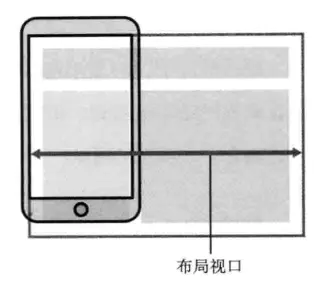
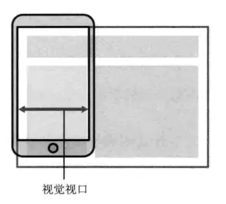

# 移动端适配的基础概念

## 英寸

英寸（inch，缩写为 in），英寸和厘米的换算为：1 英寸 = 2.54 厘米。  
生活中，我们经常说手机、显示器是多少寸的，其实这里的寸说的就是英寸，比如：我的手机是 6.5 寸的屏，其实就是在说手机屏幕的对角线长度为 6.5 英寸。

## 像素 pixel/px

像素可以理解为一个具有特定位置和颜色的小方块。
比如我们靠近显示器屏幕，或者将图片或视频放大到一定程度，就能发现上面的图案都是由一个个不同颜色的"小方块"组成的，这一个个小方块就是像素。~~观察显示屏的话最好选一些老旧的分辨率低的比较容易看见，像现在的手机等移动设备像素密度太高，几乎看不出来了~~

### 设备像素 device pixel/dp

设备像素又称物理像素，单位是 pt。是硬件设备上的真实的物理单元，随出厂后就固定了，俗称分辨率。  
常用的分辨率有屏幕分辨率和图片分辨率，分别表示屏幕或图片由多少分辨率组成。

> 比如如 iPhoneX 的分辨率是 2436pt × 1125px,表示屏幕有 2436 行，1125 列像素点组成。

### PPI (pixel per inch)

PPI 表示每英寸包含的像素个数  
相同尺寸下，PPI 越高，证明其包含的像素数越多，则能表现得细节也就越多，屏幕或图片就越清晰。

> 计算公式 (水平像素点数 ²+垂直像素点数 ²)/尺寸

### DPI (dot per inch)

DPI 表示每英寸包含的点数，点数是一个抽象单位，在描述屏幕或图片是可以理解为像素点，在描述打印机时表示墨点，同理 DPI 越高，屏幕，图片或打印效果就越清晰。

### 设备独立像素 device-independent pix/DIP

设备独立像素又称 css 像素或虚拟像素，是 web 编程中的概念。  
由于随着科技的发展，显示设备的分辨率也变得越来越高，同样尺寸下的屏幕，DPI 也就越高。那么，同样分辨率的图片，在 DPI 更高的屏幕上，就会看起来更小。为了避免这种情况，设备独立像素这个概念被提了出来。  
可以这样理解，我们用设备独立像素来描述一个元素的"实际"大小，使其在不同 DPI 的屏幕上显示同一个元素时大小基本不变，不会随着 DPI 的变化而改变。

### 设备像素比 device pixel ratio/DPR

设备像素比是 物理像素 / 设备独立像素 的值。
在浏览器中可以通过 window.devicePixelRatio 来获取；  
在 CSS 中可以通过媒体查询 min-device-pixel-ratio 来获取；

### 视口
#### PC端的视口
视口(viewport)代表当前可见的计算机图形区域。在 Web 浏览器术语中，通常与浏览器窗口相同，但不包括浏览器的 UI， 菜单栏等——即指你正在浏览的文档的那一部分。
在浏览器中可以通过 window.innerWidth 和 window.innerHeight 来获得。
> window.outWidth 和 window.outerHeight 包含了innerWidth和innerHeight，地址栏与书签栏及水平滚动条和垂直滚动条等所有高度和宽度。
#### 移动端视口
移动端涉及三个视口 布局视口，视觉视口，理想视口
##### 布局视口 layout viewport
> 一般移动设备的浏览器都默认设置了一个 viewport 元标签，定义一个虚拟的布局视口（layout viewport），用于解决早期的页面在手机上显示的问题。iOS, Android 基本都将这个视口分辨率设置为 980px，所以 PC 上的网页基本能在手机上呈现，只不过元素看上去很小，一般默认可以通过手动缩放网页。
>   
> 布局视口的宽度/高度可以通过 document.documentElement.clientWidth / Height 获取  
> 布局视口宽度一般默认为 980px，也可以用HTML中的meta标签进行设置：
> \<meta name="viewport" content="widht=400">  
> 布局视口使视口与移动端浏览器屏幕宽度完全独立开，CSS 布局将会根据他来进行计算，并被他约束。
#### 视觉视口 visual viewport
> 视觉视口是用户当前看到的区域，用户可以通过缩放操作视觉视口，同时不会影响布局视口。  
>   
#### 理想视口 ideal viewport
> 布局视口的默认宽度并不是一个理想的宽度，于是 Apple 和其他浏览器厂商引入了理想视口的概念，它对设备而言是最理想的布局视口尺寸。显示在理想视口中的网站具有最理想的宽度，用户无需进行缩放。  
> 理想视口的值其实就是屏幕分辨率的值，它对应的像素叫做设备逻辑像素（device independent pixel, dip）。dip 和设备的物理像素无关，一个 dip 在任意像素密度的设备屏幕上都占据相同的空间。如果用户没有进行缩放，那么一个 CSS 像素就等于一个 dip。  
> 用下面的方法可以使布局视口与理想视口的宽度一致：  
> \<meta name="viewport" content="width=device-width">  
> 这也是响应式布局的基础。