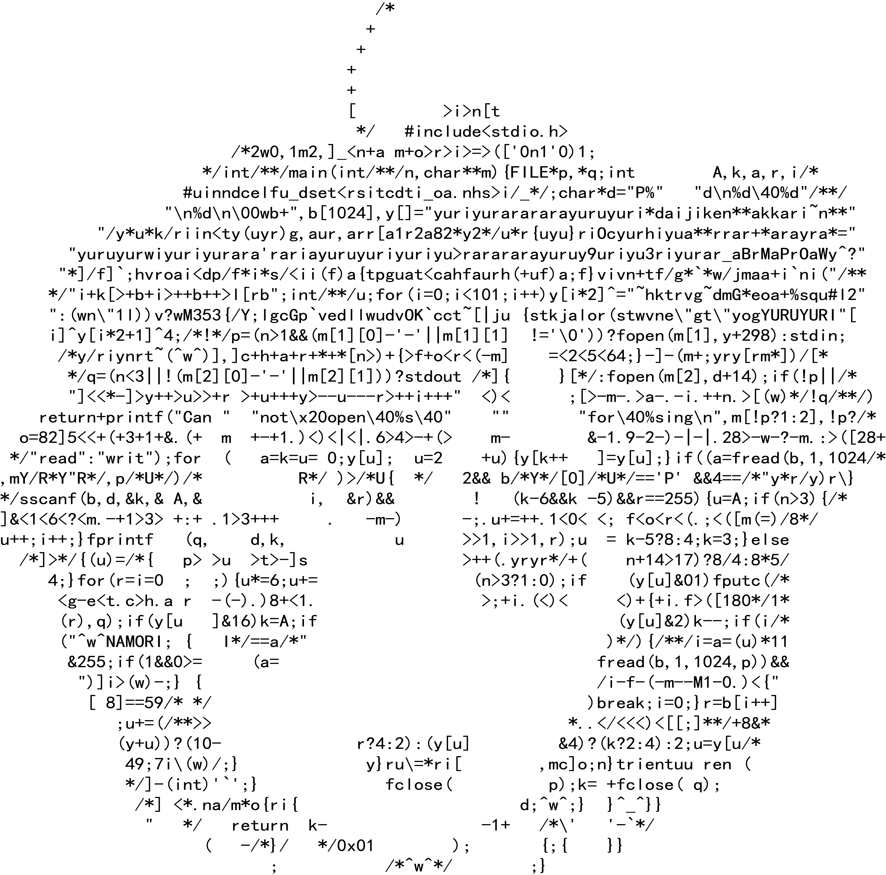

# Markdown 语法速查

- Markdown 作为一种轻量级标记语言，被广泛用于撰写文档或者博客。为了更快的熟悉使用 markdown 写博客，特把 markdown 所有语法记录下来，便于以后查阅。

## 标题

> # \# 一级标题
> ## \## 二级标题
> ### \### 三级标题
> #### \#### 四级标题
> ##### \##### 五级标题
> ###### \###### 六级标题

---

## 字体

> \*_斜体_\*  
> \__斜体文本_\_  
> \*\***粗体文本**\*\*  
> \_\_**粗体文本**\_\_  
> \*\*\***_粗斜体文本_**\*\*\*  
> \_\_\_**_粗斜体文本_**\_\_\  

---

## 分割线

- 一行中用三个以上的星号、减号、底线来建立一个分隔线，行内不能有其他东西。你也可以在星号或是减号中间插入空格。
- 例：  
   \-\-\-  
   \*\*\*  
   \- \- \-  
   \*\*\*\*\*\*

---

## 删除线

- ~~要删除文本~~

---

## 下划线

- \<u\><u>下划线文本</u>\</u\>

---

## 列表

### 无序列表

- 无序列表使用星号(\*)、加号(+)或是减号(-)作为列表标记，这些标记后面要添加一个空格，然后再填写内容

* 列表项
  - 子列表项
  - 子列表项
* 列表项
  - 子列表项
  - 子列表项
* 列表项

### 有序列表

- 有序列表使用数字加 . 来表示

1. 第一项
2. 第二项
3. 第三项

---

### 区块

区块引用是在段落开头使用 > 符号后面跟一个空格符号实现

> 区块  
> 区块
>
> > 第二层区块
> >
> > > 第三层区块  
> > > 第三层区块
>
> - 区块中列表
>
> 1. 有序列表  
>    区块

### 区块列表

- 列表项
- > 列表中区块  
  > 列表中区块
- 列表项

---

## 代码

markdown 中的代码需要使用 \` 符号包裹起来
`console.log("Hello,world.")`
或 使用 \`\`\` 包裹并指定一种语言(也可以不指定)

```javascript
const numObject = {
  a: 10,
};
```

---

## 链接

### 普通链接

链接格式如下：  
\[链接名\]\(链接地址\)  
或  
\<链接地址\>

> [github 主页](https://github.com)  
> 我也是链接地址 <https://github.com>

### 高级链接

> [谷歌][google]  

*emmmmmm,高级链接貌似有一点格式要求？中间必须要空出一行？~~至少在我这里是这样...~~*
> [google]: https:google.com

---

## 图片

图片链接格式如下：  
\!\[alt 属性文本\]\(本地或网络都可以\)

> 本地
>
> > 

> 网络
>
> > 

或者使用 html 的\标签也可以，好处是可以指定图片大小。

> 

---

## 表格

表格使用 | 来分隔不同的单元格，使用 - 来分隔表头和其他行  
\| 表头 \| 表头 \|  
\| ----- | ----- |  
\| 单元格 | 单元格 |

| 表头(左对齐) | 表头(右对齐) | 表头(居中) |
| :----------- | -----------: | :--------: |
| 单元格 1     |     单元格 1 |  单元格 1  |
| 单元格 22    |    单元格 22 | 单元格 22  |

---

## Markdown 支持的 HTML 元素

\<kbd> \<b> \<i> \<em> \<sup> \<sub> \<br>等

---

## 公式

在编辑器中插入数学公式时，使用两个美元符 \$\$ 包裹 TeX 或 LaTeX 格式的数学公式来实现。提交后，问答和文章页会根据需要加载 Mathjax 对数学公式进行渲染。

- 例：
  $$
  \mathbf{V}_1 \times \mathbf{V}_2 =  \begin{vmatrix}
  \mathbf{i} & \mathbf{j} & \mathbf{k} \\
  \frac{\partial X}{\partial u} &  \frac{\partial Y}{\partial u} & 0 \\
  \frac{\partial X}{\partial v} &  \frac{\partial Y}{\partial v} & 0 \\
  \end{vmatrix}
  ${$tep1}{\style{visibility:hidden}{(x+1)(x+1)}}
  $$

---

## 流程图

待添加
